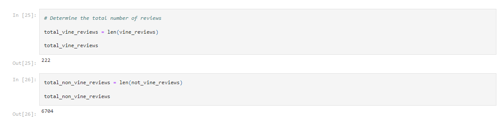

# Amazon_Vine_Analysis - Challenge Number 16 

## Overview of the Analysis

The purpose of the analysis was to assist the $ellBy company with analyzing reviews provided by customers compared to those of their competitors.  By using Spark and AWS and Pandas, we were able to transform the data provided into numbers and charts for easy comparison.  We then broke down the results into reviewers who were paid for their reviews vs. viewers who were unpaid.  From there we also broke down the data into 5 star reviews reviewed by people who were paid for their 5 star review vs. people who were unpaid for their review.  

## Results

*** 

* Vine Versus Non-Vine Reviews

As shown in the image below, the number of total vine reviews appears to be 222.  The total of non-vine reviews is much higher at 6,704.  The total number of reviews was calculated by calling the len function and using the vine_reviews column to gather the data.  The same was done for the non-vine reviews except we used not_vine_reviews. 

* 5 Star Reviews 

To find the number of 5 star reviews, we used the len function again and set the star_rating equal to 5.  We did the same for the non-vine reviews.  Based on the calculations, there were 111 vine reviews compared to 3,339 non-vine reviews as shown in the images below.  

* Percentage of Vine vs. Non-Vine Reviews 

It appears based on the results that the actual percentage of paid vs. unpaid 5 star reviews is about the same with the vine reviews being .5 or 50% and non-vine being .49 or 49% as shown in the images below.  This was calculated by dividing the number of vine/non-vine ratings over the total vine/non-vine reviews. 

## Summary

In conclusion, it is my opinion that the number of ratings is so significantly different and much less for those that were considered vine vs. those that were not vine that I don't think there is much evidence of positivity bias.  Such can be supported by the calculations found in the totals of the vine vs. non-vine reviews.  An additional analysis we could do is to conduct another perhaps anonymous review to see if being paid in exchange for providing a 5 star review would in fact influence their decision.  
